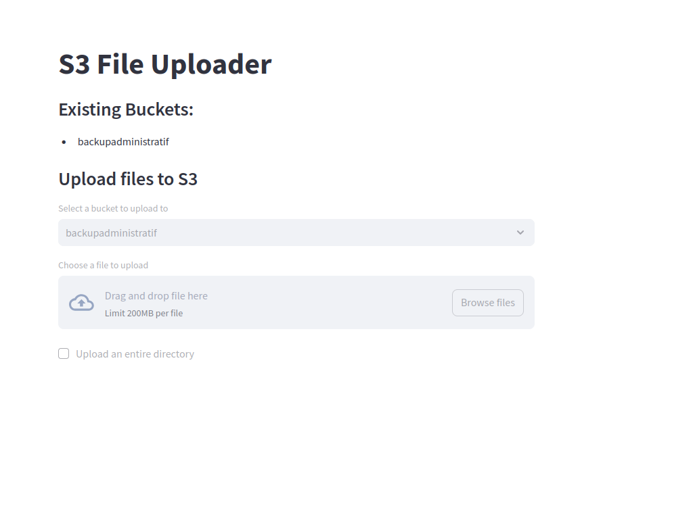

## AWS S3 backup

git pull https://github.com/gabriel04100/automated-backup-s3.git  
install requirements .txt  
setup a .env with directory and bucket name 
setup your iam account via aws  
you can launch the script to push your files to aws s3 service 

